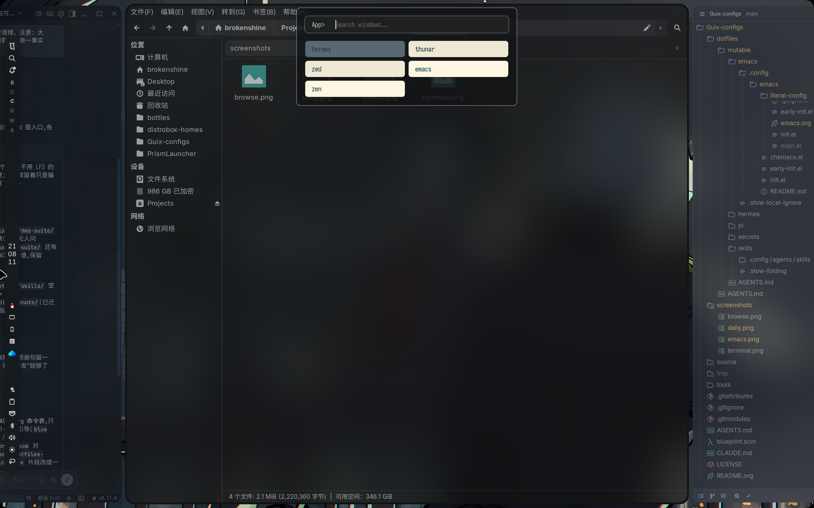
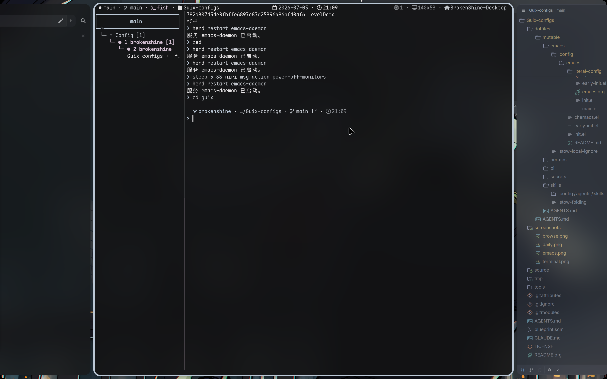
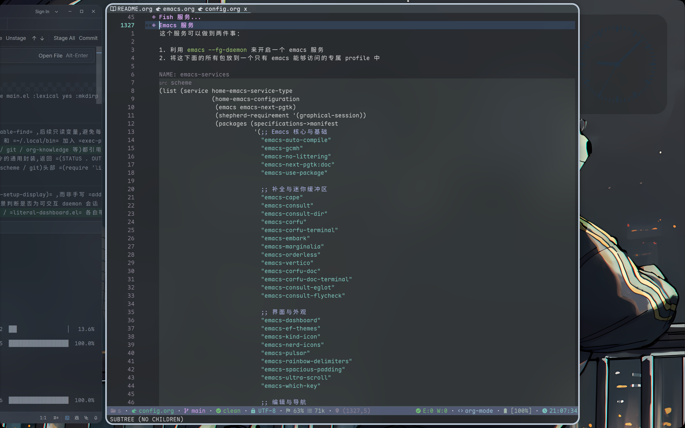
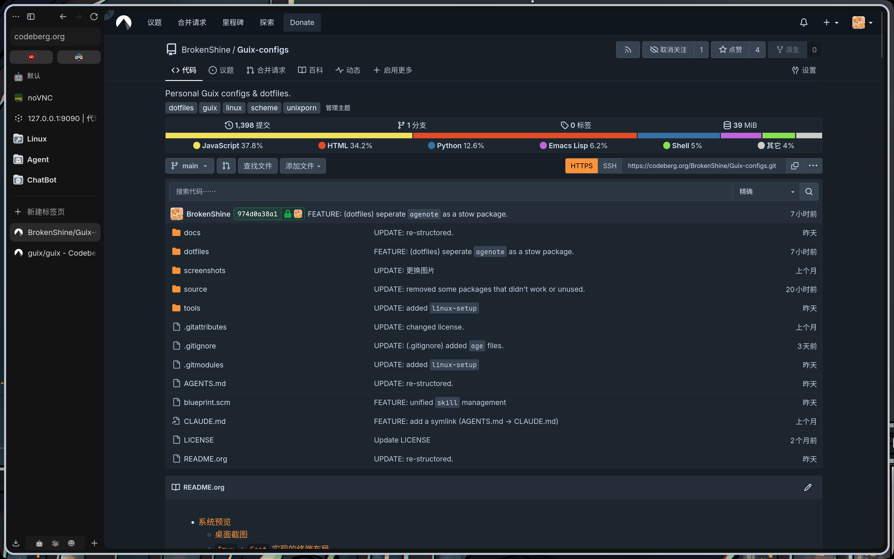

<!--
SPDX-FileCopyrightText: 2026 BrokenShine <xchai404@gmail.com>

SPDX-License-Identifier: GPL-3.0
-->

```
▗▄▄▖  ▄▄▄ ▄▄▄  █  ▄ ▗▞▀▚▖▄▄▄▄   ▗▄▄▖▐▌   ▄ ▄▄▄▄  ▗▞▀▚▖  ▄   ▄▄▄
▐▌ ▐▌█   █   █ █▄▀  ▐▛▀▀▘█   █ ▐▌   ▐▌   ▄ █   █ ▐▛▀▀▘     ▀▄▄
▐▛▀▚▖█   ▀▄▄▄▀ █ ▀▄ ▝▚▄▄▖█   █  ▝▀▚▖▐▛▀▚▖█ █   █ ▝▚▄▄▖     ▄▄▄▀
▐▙▄▞▘          █  █            ▗▄▄▞▘▐▌ ▐▌█
                                           ▗▄▄▖█  ▐▌▄ ▄   ▄
                                          ▐▌   ▀▄▄▞▘▄  ▀▄▀
                                          ▐▌▝▜▌     █ ▄▀ ▀▄
                                          ▝▚▄▞▘     █
                                          ▗▄▄▖▄▄▄  ▄▄▄▄  ▗▞▀▀▘ ▄   █  ▐▌ ▄▄▄ ▗▞▀▜▌   ■  ▄  ▄▄▄  ▄▄▄▄
                                         ▐▌  █   █ █   █ ▐▌    ▄   ▀▄▄▞▘█    ▝▚▄▟▌▗▄▟▙▄▖▄ █   █ █   █
                                         ▐▌  ▀▄▄▄▀ █   █ ▐▛▀▘  █        █           ▐▌  █ ▀▄▄▄▀ █   █
                                         ▝▚▄▄▖           ▐▌    █ ▗▄▖                ▐▌  █
                                                                ▐▌ ▐▌               ▐▌
                                                                 ▝▀▜▌
                                                                ▐▙▄▞▘
```

> 一套模块化、声明式的 Guix 系统配置，利用 Org Mode 带来的文学编程（Literate Programming）能力来强化可读性

---

## 系统预览

### 桌面截图




### Emacs 截图



### `LibreWolf` 配合 **[parfait](https://github.com/reizumii/parfait)** 主题



---

## 目录

- [核心概念速览](#核心概念速览)
- [仓库架构详解](#仓库架构详解)
- [快速开始](#快速开始)
- [可复用组件指南](#可复用组件指南)
- [配置分层策略](#配置分层策略)
- [常用任务](#常用任务)
- [故障排除](#故障排除)

---

## 核心概念速览

在深入配置前，先理解几个 Guix 特有的概念：

### 1. Channel（频道）

Guix 的软件包定义分布在多个「频道」中。默认只有 `guix` 官方频道，本配置额外添加了：

- **[nonguix](https://gitlab.com/nonguix/nonguix)** - 提供 Linux 内核、专有驱动等
- **[jeans](https://codeberg.org/BrokenShine/jeans)** - 个人频道，包含自定义包
- **[rosenthal](https://codeberg.org/hako/rosenthal)** - 提供很多用于强化 window manager 体验的相关组件

频道定义在 [`source/channel.scm`](./source/channel.scm)，版本锁定在 [`source/channel.lock`](./source/channel.lock)。

**版本锁定**的相关文件 (`channel.lock`) 实际上利用了 channel 的参数中可以指定 **commit** 的特点，通过锁住 commit 来固定仓库

### 2. System vs Home

Guix 有两层配置：

| 层级       | 管理范围                         | 对应命令      | 配置文件来源                       |
| ---------- | -------------------------------- | ------------- | ---------------------------------- |
| **System** | 内核、引导、系统服务、全局软件包 | `guix system` | `source/configs/system-config.org` |
| **Home**   | 用户软件包、dotfiles、用户服务   | `guix home`   | `source/configs/home-config.org`   |

**原则**：能用 Home 解决就不用 System，保持系统层最小化。

### 3. Org 模式配置（Literate Configuration）

配置写在 `.org` 文件中，代码嵌入在 `src` 代码块里。这样做的好处：

- 配置和文档在一起
- 可以用 Emacs 的 `org-babel-tangle` 提取代码
- 阅读体验更好

本仓库使用 `maak` 自动处理 Org 文件的导出。

---

## 仓库架构详解

```text
.
├── maak.scm                # 任务运行器配置（类似 Makefile）
├── source/                 # 配置源码（你主要修改这里）
│   ├── channel.scm         # 频道定义
│   ├── channel.lock        # 频道版本锁定
│   ├── information.scm     # 全局变量（用户名、Btrfs 配置等）
│   ├── configs/            # Org 格式配置文档
│   │   ├── home-config.org     # Home 环境配置
│   │   └── system-config.org   # 系统配置
│   ├── files/              # 静态配置文件模板
│   │   ├── niri.kdl            # Niri 窗口管理器配置
│   │   ├── nftables.conf       # 防火墙规则
│   │   └── ...
│   └── nix/                # Nix 配置（实验性，可忽略）
├── dotfiles/               # 用户配置文件（Stow 格式）
│   ├── desktop/            # 桌面环境配置（Waybar、Fuzzel 等）
│   ├── terminal/           # 终端配置（Foot、Fish、Helix 等）
│   ├── system/             # 系统工具配置（Btop、Mako 等）
│   ├── utilities/          # 实用工具配置
│   ├── themes/             # GTK/Qt 主题配置
│   ├── termide/            # 终端 IDE 配置
│   └── emacs/              # Emacs 配置（独立子树）
├── screenshots/            # 预览截图
└── tmp/                    # 生成的完整配置（临时，勿手动编辑）
```

### 关键入口

| 文件/目录                          | 用途                               | 修改频率                   |
| ---------------------------------- | ---------------------------------- | -------------------------- |
| `source/information.scm`           | 定义用户名、Btrfs 子卷、持久化目录 | 初次使用时必改             |
| `source/channel.scm`               | 定义软件源频道                     | 需要添加第三方软件源时修改 |
| `source/configs/home-config.org`   | 用户软件包、服务、dotfiles 配置    | 经常                       |
| `source/configs/system-config.org` | 系统级配置                         | 较少                       |
| `dotfiles/*`                       | 实际的用户配置文件                 | 经常                       |
| `maak.scm`                         | 任务定义                           | 需要添加自定义任务时修改   |

---

## 快速开始

### 1. 安装系统（新机器）

```bash
# 进入 Guix 安装环境后，克隆本仓库
git clone https://codeberg.org/BrokenShine/Guix-configs
cd ./Guix-configs

# 修改 source/information.scm 中的用户名等基本信息
# 然后初始化系统
guix shell maak -- maak init
```

### 2. 日常更新（已安装系统）

```bash
# 查看所有可用命令
maak --list

# 常用命令
maak system     # 应用系统配置（需要 sudo）
maak home       # 应用用户配置
maak rebuild    # 先 system 后 home，并更新 locate 数据库

# 更新软件包频道
maak upgrade    # 更新系统中所有仓库到最新版本
```

---

## 可复用组件指南

以下组件设计为可独立复用，你可以直接复制到自己的配置中：

### ✅ 完全独立可复用

#### 1. 内核优化参数 ([`source/configs/system-config.org`](./source/configs/system-config.org))

```scheme
(kernel-arguments
  '("zswap.enabled=1"
    "zswap.compressor=zstd"
    "zswap.max_pool_percent=20"
    "zswap.zpool=zsmalloc"
    "net.ipv4.tcp_congestion_control=bbr"
    "net.ipv4.tcp_fastopen=3"
    "vm.vfs_cache_pressure=50"
    "kernel.sched_autogroup_enabled=1"))
```

**如何复用**：直接复制到 `operating-system` 的 `kernel-arguments` 字段。

#### 2. 静态配置文件 ([`source/files/`](./source/files/))

- `niri.kdl` - Niri Wayland 合成器配置（平铺窗口管理器）
- `nftables.conf` - 基于 nftables 的防火墙规则
- `zed.json` - Zed 编辑器配置

**如何复用**：直接复制文件内容，或在自己的配置中使用 `(local-file "...")` 引用。

#### 3. Org 模式配置工作流

本仓库的核心创新：用 Org 文件管理配置，通过 `maak` 自动提取。

```scheme
;; maak.scm 中的关键函数
(define (generate-config-from-org org-file)
  "使用 Emacs 的 org-babel-tangle 导出 Org 文件"
  ...)
```

**如何复用**：

1. 复制 `maak.scm`，并安装`maak`
2. 将 `.scm` 配置改写为 `.org` 格式
3. 用 `#+begin_src scheme :tangle ...` 包裹代码块

### ⚠️ 需要适配后复用

#### 1. Btrfs + tmpfs 混合架构 ([`source/information.scm`](./source/information.scm))

实现「重启后根目录清空，但数据持久化」的不可变系统效果:

(具体需要持久化哪些目录，以及 btrfs 的相关结构，都需要做对应的修改)

```scheme
;; 定义需要持久化的数据目录
(define %data-dirs
  '(".var"
    ".local/share/PrismLauncher"
    "Documents"
    "Downloads"
    "Pictures"
    ...))

;; 定义 Btrfs 子卷映射
(define %btrfs-subvolumes
  '(("SYSTEM/Guix/@data"   "/var/lib")
    ("SYSTEM/Guix/@gnu"    "/gnu")
    ("DATA/Home/Guix"      "/home")
    ...))
```

**如何复用**：参考 `information.scm` 中的 `%data-dirs` 和 `%btrfs-subvolumes` 定义，配合 `system-config.org` 中的 Btrfs 挂载配置。

#### 2. Dotfiles 组织方式 ([`dotfiles/`](./dotfiles/))

采用 [GNU Stow](https://www.gnu.org/software/stow/) 格式：

```
dotfiles/
├── desktop/.config/waybar/       # → ~/.config/waybar/
├── terminal/.config/fish/        # → ~/.config/fish/
└── terminal/.config/foot/        # → ~/.config/foot/
```

**如何复用**：在 `home-config.org` 中：

```scheme
(service home-dotfiles-service-type
  (home-dotfiles-configuration
    (package `("desktop" "terminal" "system" ...))))
```

---

## 配置分层策略

理解何时修改哪个文件：

### 添加新软件包

1. **仅用户需要** → `source/configs/home-config.org`
   - 添加到 `packages` 字段
   - 示例：游戏、开发工具、媒体播放器

2. **系统级必需** → `source/configs/system-config.org`
   - 添加到 `packages` 字段
   - 示例：文件系统工具、系统监控、固件

### 添加新服务

1. **用户服务**（如 swayidle、mako）→ `home-config.org`
2. **系统服务**（如 nftables、docker）→ `system-config.org`

### 添加配置文件

**优先放入 `dotfiles/`**，遵循 Stow 规范：

```bash
# 示例：添加 Alacritty 配置
mkdir -p dotfiles/alacritty/.config/alacritty
cp ~/alacritty.toml dotfiles/alacritty/.config/alacritty/

# 然后在 home-config.org 中添加 alacritty 到 packages 列表
# 并确保 alacritty 包已安装
```

**仅在需要动态生成时使用 `source/files/`**（如需要注入 Guix 软件包路径）。

---

## 常用任务

### 修改用户名

编辑 `source/information.scm`：

```scheme
(define username "your-username")
```

然后重新运行 `maak home`。

### 添加 Btrfs 持久化目录

编辑 `source/information.scm`：

```scheme
(define %data-dirs
  '(... "your-new-dir"))
```

然后在 `system-config.org` 的 Btrfs 配置部分添加对应的 `bind-mount`。

### 添加新的 Channel

编辑 `source/channel.scm`，添加频道定义，然后运行：

```bash
maak upgrade
```

### 自定义 `maak` 任务

编辑 `maak.scm`，添加新函数：

```scheme
(define (my-task)
  "我的自定义任务"
  (log-info "执行自定义任务")
  ($ `("echo" "Hello, Guix!")))
```

然后运行 `maak my-task`。

---

## 故障排除

### `maak home` 提示找不到目录

确保 `dotfiles/<name>` 目录存在，且与 `home-dotfiles-configuration` 中声明的 `packages` 一致。

### 系统启动后数据丢失

检查 `source/information.scm` 中的 `%data-dirs` 和 Btrfs 子卷配置是否正确，确保 `/data` 分区已正确挂载。

### Channel 冲突

如果遇到频道哈希不匹配错误，尝试：

```bash
rm -rf ~/.cache/guix
maak pull
```

### Org 导出失败

确保安装了 Emacs 且启用了 `org-babel-tangle`：

```bash
emacs --batch -l org --eval "(require 'ob-tangle)"
```

---

## 技术规格

| 组件       | 选择                       | 说明                |
| ---------- | -------------------------- | ------------------- |
| 内核       | Linux XanMod (nonguix)     | 性能优化内核        |
| 显示服务器 | Wayland                    | 现代显示协议        |
| 窗口合成器 | Niri                       | 滚动式平铺管理器    |
| 显示管理器 | Greetd + tuigreet          | TUI 登录界面        |
| 终端       | Foot                       | 轻量级 Wayland 终端 |
| Shell      | Fish                       | 友好的交互式 Shell  |
| 编辑器     | Emacs / Zed / Helix        | 多编辑器配置        |
| 输入法     | Fcitx5 + Rime              | 中文输入法          |
| 字体       | Sarasa Gothic / Maple Mono | 中文优化字体        |

---

## 致谢

- [GNU Guix 中国社区](https://t.me/guixcn) - 提供关键技术支持
- Grok, ChatGPT, Gemini, Kimi, Claude, GLM, Qwen - 协助开发

---

> **日々私たちが過ごしている日常は、実は、奇跡の連続なのかもしれない。** ——《日常》
