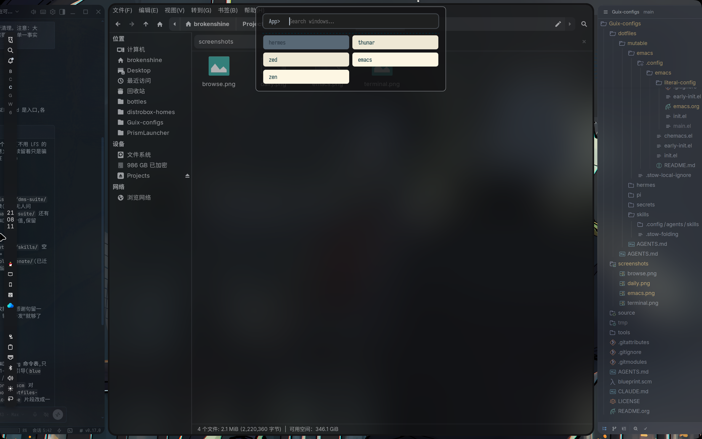
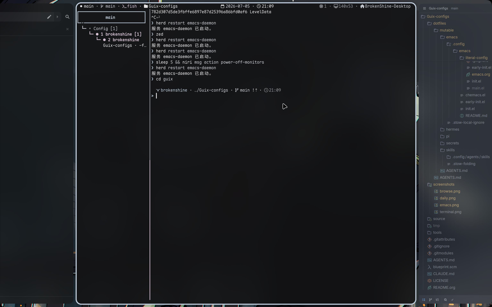
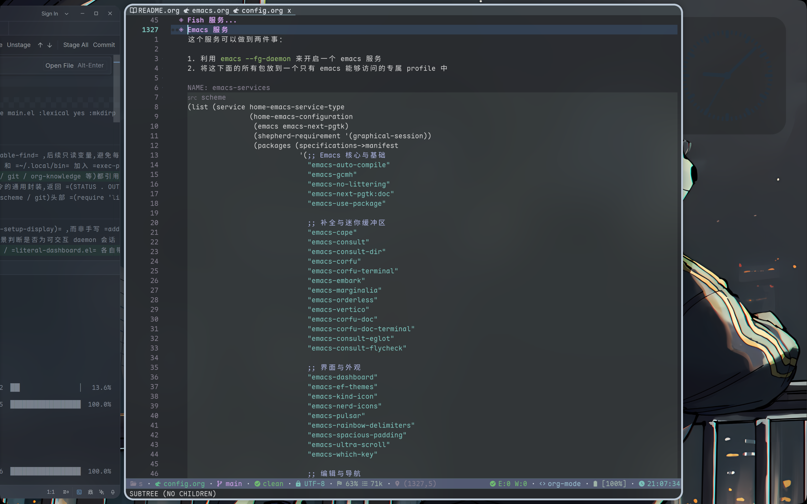
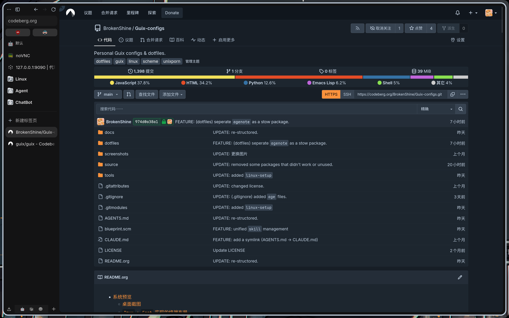

# SPDX-FileCopyrightText: 2026 BrokenShine <xchai404@gmail.com>
#
# SPDX-License-Identifier: MIT

#+begin_example
▗▄▄▖  ▄▄▄ ▄▄▄  █  ▄ ▗▞▀▚▖▄▄▄▄   ▗▄▄▖▐▌   ▄ ▄▄▄▄  ▗▞▀▚▖  ▄   ▄▄▄
▐▌ ▐▌█   █   █ █▄▀  ▐▛▀▀▘█   █ ▐▌   ▐▌   ▄ █   █ ▐▛▀▀▘     ▀▄▄
▐▛▀▚▖█   ▀▄▄▄▀ █ ▀▄ ▝▚▄▄▖█   █  ▝▀▚▖▐▛▀▚▖█ █   █ ▝▚▄▄▖     ▄▄▄▀
▐▙▄▞▘          █  █            ▗▄▄▞▘▐▌ ▐▌█
                                           ▗▄▄▖█  ▐▌▄ ▄   ▄
                                          ▐▌   ▀▄▄▞▘▄  ▀▄▀
                                          ▐▌▝▜▌     █ ▄▀ ▀▄
                                          ▝▚▄▞▘     █
                                          ▗▄▄▖▄▄▄  ▄▄▄▄  ▗▞▀▀▘ ▄   █  ▐▌ ▄▄▄ ▗▞▀▜▌   ■  ▄  ▄▄▄  ▄▄▄▄
                                         ▐▌  █   █ █   █ ▐▌    ▄   ▀▄▄▞▘█    ▝▚▄▟▌▗▄▟▙▄▖▄ █   █ █   █
                                         ▐▌  ▀▄▄▄▀ █   █ ▐▛▀▘  █        █           ▐▌  █ ▀▄▄▄▀ █   █
                                         ▝▚▄▄▖           ▐▌    █ ▗▄▖                ▐▌  █
                                                                ▐▌ ▐▌               ▐▌
                                                                 ▝▀▜▌
                                                                ▐▙▄▞▘
#+end_example

#+begin_quote
一套模块化、声明式的 Guix 系统配置，利用 *Org Mode* 带来的文学编程（Literate Programming）能力来强化可读性。
#+end_quote

--------------

* 系统预览

桌面（=Niri=）：

Tmux 终端布局：

=Emacs=：

=Zen Browser=：

* 技术规格

| 组件       | 选择                          |
|------------+-------------------------------|
| 内核       | =linux-cachyos-lts=（自编译） |
| 引导器     | =Limine=（=rosenthal=）       |
| 显示服务器 | Wayland                       |
| 窗口合成器 | =Niri=                        |
| 显示管理器 | =Greetd= + =tuigreet=         |
| 终端       | #ERROR                        |
| 终端复用器 | =Tmux=                        |
| Shell      | =Fish=                        |
| 编辑器     | =Emacs= / =Lem= / =Zed= / =Helix=  |
| 输入法     | =Fcitx5= + =Rime=              |
| 字体       | =Sarasa Gothic= / =Maple Mono= |
#+TBLFM: $2=Kitty=（含快速访问终端）

* 快速开始

** 装机（新机器）

#+begin_src sh
# 用官方 Guix ISO 启动后，克隆本仓库
git clone https://codeberg.org/BrokenShine/Guix-configs
cd Guix-configs

# 用锁定的频道准备带 blue 的引导 shell（不分区、不做破坏性操作）
./tools/bootstrap.sh

# 修改 source/information.scm 里的用户名等基本信息，然后初始化系统
blue init

# 配置不携带初始密码 hash（公开仓库不存凭据）：首次进入新系统后
# 立即设置用户密码，否则账户无法登录
passwd
#+end_src

- 自建 Live ISO 替代官方 ISO：见 [[./docs/iso-build.md][docs/iso-build.md]]
- SSH 私钥等机密的加密入仓与恢复：见 [[./docs/secrets.md][docs/secrets.md]]

** 日常使用（已装机）

绝大多数操作只有两个命令：

- =blue rebuild= —— tangle → 括号检查 → 单次 reconfigure 同时应用系统与 Home（需 sudo）
- =blue home= —— 仅应用 Home 层，不需要 sudo，适合调试 dotfiles

其他常用项： =blue update= 刷新频道锁并签名提交， =blue pull= 执行 =guix pull= 。完整命令清单直接运行 =blue help= 查看，描述与实现一一对应，此处不再重复维护。任何 blue 命令加 =--dry-run= 都只做构建验证、不写入系统。

* 仓库导读

唯一声明源是 [[./source/config.org][source/config.org]]——系统与 Home 用一份 Org 写完，文档与代码同块共存，标题即目录，通读它就是通读整套配置。想找其他入口，按下面这张表：

| 想理解 / 想修改                   | 入口                                    | 说明                                 |
|-----------------------------------+-----------------------------------------+--------------------------------------|
| 系统与 Home 的全部配置            | [[./source/config.org][source/config.org]]                       | 唯一 Org 源，按块分主题              |
| 用户名、机器 ID、持久化目录、子卷 | [[./source/information.scm][source/information.scm]]                  | 装机必改，纯 define 自解释           |
| 频道定义与版本锁定                | [[./source/channel.scm][source/channel.scm]]、[[./source/channel.lock][source/channel.lock]] | lock 由 =blue update= 生成，勿手改     |
| 引导 shell 的包清单               | [[./source/manifest.scm][source/manifest.scm]]                     | 供 =tools/bootstrap.sh= 使用           |
| 需路径注入的静态模板              | [[./source/files/][source/files/]]                           | nftables、Qt 主题、zed.json、skel 等 |
| 备用 Nix home-manager             | [[./source/nix/][source/nix/]]                             | 独立 flake，不经 blue                |
| blue 任务定义                     | [[./blueprint.scm][blueprint.scm]]                           | 现有命令即自定义任务的范本           |
| 构建期进 store 的 dotfiles        | [[./dotfiles/immutable/][dotfiles/immutable/]]                     | 改源后须 =blue home= 重建才生效        |
| Stow 直链的 dotfiles              | [[./dotfiles/mutable/][dotfiles/mutable/]]                       | 改源即生效                           |
| 主题文档                          | [[./docs/][docs/]]                                   | 自建 ISO、加密机密管理               |
| 引导与辅助脚本                    | [[./tools/][tools/]]                                  | =bootstrap.sh= 等                      |

各主要目录与应用子目录都带一份 =AGENTS.md= 分层导读，人类同样可读——这里没讲到的细节从那里进。

* 核心概念

在深入配置前，先理解几个 Guix 特有的概念：

** Channel（频道）

Guix 的软件包定义分布在多个「频道」。本配置除官方 =guix= 外，还启用了 =nonguix=（Linux 内核、专有驱动）、=jeans=（个人频道）、=rosenthal=（=Limine= 引导器等增强组件）；完整定义见 [[./source/channel.scm][source/channel.scm]]。版本由 [[./source/channel.lock][source/channel.lock]] 锁定各频道的 commit，从而固定仓库状态。

** System + Home（统一配置）

原则：能用 Home 解决就不用 System，保持系统层最小。Home 配置经 ~guix-home-service-type~ 并入系统配置， =blue rebuild= 单次 reconfigure 即同时应用两者；日常调试用 =blue home= 临时部署，确认无误后 =blue rebuild= 固化进新世代。系统每次开机默认进入最新世代，即使误操作弄坏了部分软件，重启即可恢复。

** Org 文学编程

配置以 Org 代码块的形式写在 [[./source/config.org][source/config.org]] 里，构建时由 Emacs 的 ~org-babel-tangle~ 自动提取成 Scheme，文档与代码同源。导出与指令封装由 [[https://codeberg.org/lapislazuli/blue][blue]] 框架完成，完整指令见 =blue help= 。

** 构建管线

#+begin_example
source/config.org
        │
        │  blue rebuild → org-babel-tangle + 括号检查
        ▼
tmp/config.scm
        │
        │  guix time-machine --channels=source/channel.lock system reconfigure
        │  （单次同时应用系统与 Home）
        ▼
新世代（generation）
#+end_example

* 常见修改

** 用户名 / 持久化目录 / 频道

三者都是「改一个文件 + 跑一条命令」：

- 用户名、机器 ID、持久化目录 ~%data-dirs~ 、Btrfs 子卷 ~%btrfs-subvolumes~ ：编辑 [[./source/information.scm][source/information.scm]]（文件内注释自解释；新增子卷挂载时还需在 config.org 的 Btrfs 部分补对应的 bind-mount），然后 =blue rebuild=
- 新增频道：编辑 [[./source/channel.scm][source/channel.scm]]，然后 =blue update=

** 自定义 blue 任务

blue 子命令不是普通函数：须以 ~(define-command (NAME-command arguments) ...)~ 形式声明，并登记进 [[./blueprint.scm][blueprint.scm]] 末尾的命令列表。最快的路径是照抄文件里现成的命令改一改；完成后用 =blue <name>= 运行， =blue --dry-run <name>= 仅做构建验证。

* 故障排除

** 改完之后先验证

- =blue check= —— 最快：逐块括号平衡检查，能定位到具体的块名
- =blue --dry-run rebuild= —— 完整构建验证，不写入系统

** 常见报错

- ~unbound variable~ —— 缺 import：用 https://search.guix.moe 查符号所属模块
- ~invalid field specifier~ —— 括号错位（gexp 多或少一个闭合），用 Emacs 的括号高亮定位
- 其余报错：先查拼写

** 开机后数据丢失

~/~ 挂载在 tmpfs 上，重启即清空。持久化目录由 [[./source/information.scm][source/information.scm]] 声明： ~%data-dirs~ 以 bind-mount 挂回 ~$HOME~ ， ~%btrfs-subvolumes~ 挂载各系统子卷。数据丢失先检查这两处配置与 ~/data~ 分区的挂载状态。

* 致谢

- [[https://t.me/guixcn][GNU Guix 中文社区]] —— 提供关键技术支持
- =Grok= 、 =ChatGPT= 、 =Gemini= 、 =Kimi= 、 =Claude= 、 =GLM= 、 =Qwen= 、 =DeepSeek= 、 =MiniMax=  —— 协助开发（按时间先后排序；其中最好用的是 =GLM= 和 =ChatGPT= ，效果最差的是 =MiniMax= ，封号最快的是 =Claude= ）

#+begin_quote
*日々私たちが過ごしている日常は、実は、奇跡の連続なのかもしれない。*
------《日常》
#+end_quote
