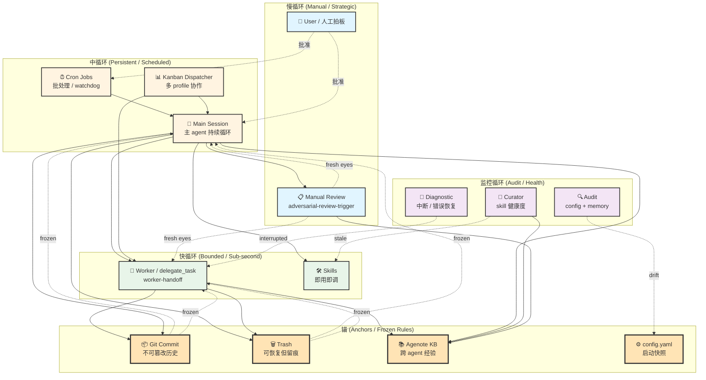

# Hermes 循环网络拓扑

> 把 hermes 的多个执行循环画成一张拓扑图，并标注**看/被看/锚/frozen rule**关系。
> 来源方法论：Carlos E. Perez《From Loop Engineering to Graph Engineering?》——单一循环的四失败（Goodhart、盲向上、循环间冲突、测量退化）的拓扑解法。

## 核心命题

**Hermes 不是一个 agent，是一个循环网络。** 主会话是一个循环，cron 是一个循环，delegate 子 agent 是一个循环，curator 是一个循环……它们**互相 watch / feed / constrain / correct**，可靠性来自 edges 不是 nodes。

## 拓扑图（Mermaid）

## 节点说明

### 慢循环 (Manual / Strategic)

| 节点 | 频率 | 作用 |
|------|------|------|
| **User** | 按需 | 拍板 / 拒绝不可逆动作 / 选方案 |
| **Manual Review** | 任务完成时 | 换 framing 审视完成声明（adversarial-review-trigger） |

**特性**：慢但权威，是锚的来源（Perez："终极判断来自系统外的人"）。

### 中循环 (Persistent / Scheduled)

| 节点 | 频率 | 作用 |
|------|------|------|
| **Main Session** | 持续 | 主 agent 持续运行，跑研究 / 调度 / 协调 |
| **Cron Jobs** | 调度驱动 | 批处理 / watchdog / 周期性任务 |
| **Kanban Dispatcher** | 调度驱动 | 多 profile 协作的工作队列 |

**特性**：承载上下文跨任务（main session）或长时跨会话（cron, kanban）。

### 快循环 (Bounded / Sub-second)

| 节点 | 频率 | 作用 |
|------|------|------|
| **Worker / delegate_task** | bounded | 子 agent 在隔离上下文跑 bounded task（worker-handoff） |
| **Skills** | 即用即调 | skill 是 procedure memory，触发后跑完整 routine |

**特性**：bounded（worker）/ 复用（skills）。短平快，不长期承担状态。

### 监控循环 (Audit / Health)

| 节点 | 频率 | 作用 |
|------|------|------|
| **Curator** | 周期（默认每日） | skill 健康度 / stale 标记 / archive |
| **Audit** | 触发式 | config + memory drift 检查 |
| **Diagnostic** | 异常触发 | 中断 / 错误恢复 |

**特性**：慢但**独立**——Perez 解 Goodhart 的关键："watcher 必须独立于被 watch 的循环"。

### 锚 (Anchors / Frozen Rules)

锚 = **不可篡改、可恢复、有迹可循** 的真实状态。Perez 的解法："some measurements must be the kind that cannot be argued with"。

| 节点 | 特性 | 用途 |
|------|------|------|
| **Git Commit** | 内容寻址 / 不可篡改 | activity record / false-success 的 audit anchor |
| **Trash (XDG)** | 可恢复 + 留 `.trashinfo` | 删文件留痕（用户硬偏好） |
| **Agenote KB** | 跨 agent 经验 + weight 评分 | durable judgment 载体 |
| **config.yaml** | 启动快照 / 修改必重启 | 配置层真相 |

**特性**：锚**不被任何循环调**（frozen rules），但**被所有循环读**。

## Edge 类型（循环网络的核心）

按 Perez 的分类法，edge 有 4 种语义：

| Edge 类型 | 含义 | 例子 |
|-----------|------|------|
| **委托 (delegation)** | 实线箭头 | M → W（主会话派任务给 worker） |
| **watch (监控)** | 虚线箭头 + label | MR -.fresh eyes.-> W |
| **feed (喂数据)** | 实线箭头（数据流） | C → M（cron 输出喂回主会话） |
| **constrain (约束)** | 虚线箭头 + frozen | TR -.frozen.-> M（trash 规则约束主会话） |
| **veto (否决)** | 粗箭头 | MR =|fail|= W（review 失败 → worker 重做） |

## Goodhart 四失败 × 网络解法

| Goodhart 失败 | 解法（topology 视角） | Hermes 中的实现 |
|---------------|----------------------|-----------------|
| **1. metric 被攻破** | 配对度量（success + counter） | task-contract 模板的 counter-metrics |
| **2. 盲向上** | 慢循环拥有快循环的 reference | cron 调度 vs 主会话 → 主会话调整 cron |
| **3. 循环间冲突** | 显式仲裁（仲裁循环拥有 trade-off） | Main session 在 cron / kanban / worker 间仲裁 |
| **4. 测量退化** | audit 循环独立于数据生产 | Curator / Audit 与 main session 数据流独立 |

## Anchors × "the original judgment comes from outside the graph"

Perez 强调："ultimate judgment 不能由 graph 内部产生"。在 Hermes 里：

- **User** 是最慢、最权威的循环
- **Manual Review** 是 user 缺席时的代理（不同 framing）
- **Agenote KB** 是 user 早期决策的累积沉淀（独立 review 入库）
- **Git Commit / Trash** 是动作的不可篡改锚

**frozen rule** 在 Hermes 里的实例：

- `approvals.mode` 默认 `smart`（不调）
- `trash-cli` 不用 `rm`（用户硬偏好）
- commit 边界严格（不混合无关改动）
- KB entry 必走独立 review

## 慢速管理循环（参考 Perez 提到的 governance 循环）

| 循环 | 频率 | 作用 |
|------|------|------|
| 日常 standup | 每日 | 主会话汇总 |
| 周计划 | 每周 | cron + kanban 调度 |
| 月审计 | 每月 | curator + audit |
| 季度 re-targeting | 每季 | 用户拍板 reference 是否还合理 |
| 年度 reset | 每年 | 用户重新审视整个 loop architecture |

## 实际使用这个拓扑图

### 用法 1：诊断系统问题

问："为什么 X 任务失败？" → 顺着 edge 找：

- M → W → GC（commit hash 在不在？）
- MR -.fail.-> W（review 找到什么问题？）
- DG -.interrupted.-> W（worker 是否中断？）

### 用法 2：设计新循环

新功能想加进循环网络 → 问：

- 这是快循环还是慢循环？
- 谁 watch 它？（必须独立）
- 它 feed 谁？
- 它约束谁？
- 锚是什么？

### 用法 3：识别"循环网络失败模式"

Perez 提到的"graph 失败"——**所有 loop 都消费同一数据**：

- 症状：curator / audit / main 都看同一个 log → 都报 green → 实际错了
- 修法：找到 audit 循环的**真实 anchor**（必须是 ground truth）

## 拓扑图不是静态的

- **新加 skill** → 必填一个 role（fast / monitor / anchor？）
- **新加 cron** → 必填 anchor 和 watch 谁
- **修改 anchor** → 必走 authority-gate（frozen rules）
- **删除循环** → 必先确认没有其他循环依赖它（写 correction funnel）

## References

- punkjazz.ai §01-§05 — Graph Engineering 原文
- Carlos E. Perez《From Loop Engineering to Graph Engineering?》
- Carlos E. Perez《Loop Engineering and The Missing Compiler》
- hermes-agent skill §"Durable & Background Systems" — cron / curator / kanban 的实现
- task-contract / adversarial-review-trigger / authority-gate / correction-funnel — 拓扑里的具体 skill 节点

## 自包含性

本文件是 reference，**不是** skill。不需要 SKILL.md frontmatter，备份 `tar ~/.local/share/hermes/skills/hermes-agent-ops/agent-loop-topology/` 完整还原。

## Out of scope

- 单个 skill 的具体 workflow → 看对应 skill
- hermes 实现细节 → `~/.local/share/hermes/skills/autonomous-ai-agents/hermes-agent/SKILL.md`
- 具体 KB 卡片 → `agenote_search` 按需检索