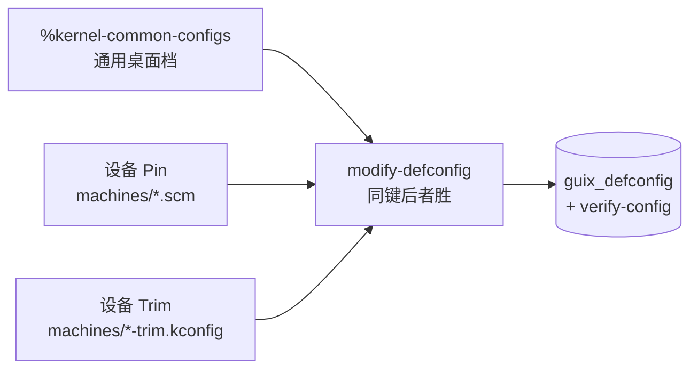

# kernel/ — CachyOS LTS 裁剪内核配置

本目录是自包含的内核定义与裁剪体系：`source/config.org` 的 `cachyos-lts-kernel` 块只 load `linux-cachyos-lts.scm` 一行。内核版本、源码来源、上游 Defconfig 引用、通用桌面档与设备裁剪清单**全部在本目录内维护**。

## 1. 文件职责

| 文件 / 路径                          | 核心职责                                                                                            | 维护规则                                   |
| ------------------------------------ | --------------------------------------------------------------------------------------------------- | ------------------------------------------ |
| `linux-cachyos-lts.scm`              | 包定义（`%cachyos-lts-version` + `%cachyos-lts-origin`）、通用桌面档 `%kernel-common-configs`、组装 | **版本升级入口**；导出 `linux-cachyos-lts` |
| `defconfig-cachyos-lts`              | 上游纯净 Defconfig（逐字取自 codeberg `hako/kernel-config` 的 `defconfig_server`，钉在 `49c98a1`）  | **禁止手动编辑**，仅随上游版本整体替换     |
| `machines/redmibook-pro-16-2024.scm` | 设备层：文件头记录实机硬件探针（裁剪依据），导出 `%machine-pin-configs` 与 `%machine-configs`       | 换机即新建同构文件并改主文件里的 load 行   |
| `machines/redmibook-trim.kconfig`    | 针对非本机硬件的大类反选清单（约 2000 行，裸符号即反选）                                            | 与 Defconfig 结构对齐，按硬件大类注释分组  |

组装的唯一表达式在主文件里：`#:configs (append %kernel-common-configs %machine-configs)`，而 `%machine-configs` 自身是 `(append %machine-pin-configs %machine-trim-configs)`。裁剪清单的文件名由 machine `.scm` 内显式引用（`call-with-input-file` 读同目录），**改名必须两处同改**。



> **覆盖规则**：`modify-defconfig` **同键后者胜**（钉住优先于反选）；同一配置符号若在同层重复出现会触发构建校验错误。删反选前先确认对应符号没被别的钉住行复写。

## 2. 三条维护路径

**升级内核版本**（最常见）：改 `%cachyos-lts-version`，再用 `guix hash <cachyos-<新版本>.tar.gz>` 算出的 base32 改 `origin` 里的 `(content-hash "...")`。必须是**字符串单参数形式**——`(sha256 …)` 兼容写法与 `(content-hash bv sha256)` 都靠 syntax-case 匹配 sha256 字面量，而本模块作用域里 `(gcrypt hash)` 的同名绑定会让匹配失效；字符串单参形式经卫生展开引入 sha256，不受遮蔽影响。

**换硬件平台**：采集硬件事实（`lspci -nnk`、`lsusb`、`lsmod`、`cat /proc/asound/cards`）写进新 `machines/<设备>.scm` 头部 → 钉住本机必需驱动（`=m` 或 `=y`）→ 在配套 trim 清单里反选非本机大类硬件 → 改主文件 load 行 → 走第 3 节验证。

**调优**：改通用档或 `machines/` 侧。符号与 Defconfig 漂移造成的冲突由构建期 `verify-config` 点名报错，按提示补删清单行即可收敛。

## 3. 验证流程（改 Kconfig 后必做）

```bash
blue check                # 语法与括号检查
blue --dry-run rebuild    # 生成 tmp/config.scm（无副作用）
```

只有这两步**验证不了 Kconfig 本身**——`--dry-run` 会短路构建。真正校验 `verify-config` 阶段要触发一次内核构建：

```bash
# probe 文件放在仓库 tmp/ 内，通过 (current-filename) 自定位，
# 无需写死仓库绝对路径（config.scm 内部本就是相对 load）
cat > tmp/kernel-probe.scm <<'EOF'
(begin
  (chdir (dirname (current-filename)))
  (set! %load-path (cons "." %load-path))
  (primitive-load "config.scm")
  linux-cachyos-lts)
EOF

guix time-machine -C source/channel.lock -- build -f tmp/kernel-probe.scm
```

**构建失败排查**：`verify-config` 会逐条打印 mismatch 的符号，可进入保留的失败构建目录 `/tmp/guix-build-linux-cachyos-lts-*.drv-0` 执行 `make ARCH=x86_64 guix_defconfig` 快速复现调试，按提示调整 Pin 或 Trim 清单。

**对拍复验**（大改与重构后）：

- **配置层**：比对新构建产物的 `.config` 与目标状态，逐符号核对 `y`/`m`/`n` 三态。
- **模块层**：比对新产物 `lib/modules/` 的 `.ko` 列表与本机 `lsmod`（内核模块文件名用连字符 `-`，`lsmod` 用下划线 `_`，**须归一化后再比**）。
- **重构零变化**：记录重构前后 `.config` 的 MD5，确保没引入语义漂移。

## 4. 裁剪方法论与关键陷阱

<critical>
1. **Default-Y 菜单门控**：上游 defconfig 是 savedefconfig 风格，省略了 default-y 的总线门控（`NETDEVICES`、`WLAN`、`ETHERNET`、`IIO` 等）。门控一旦翻成 `n` 会**连锁剔掉整个子系统**（WiFi、网卡一起没），且翻转与否取决于其余输入的组合，没有单行可循。通用档头部已显式钉住这批门控及被拖走的 default-y 子项，**严禁删除**。
2. **符号三态与隐式依赖**：只有带 Prompt 的用户可见符号可反选；由其他符号 `select` 的隐式符号写 `=n` 会被 `verify-config` 拦截。依赖不满足时写 `n` 只是无害警告。
3. **6.18 符号命名变更**：Thunderbolt 已并入 USB4（Kconfig 命名空间变 `USB4`，模块名仍是 `thunderbolt`）——钉 `CONFIG_USB4=m` 即可，再写 `CONFIG_THUNDERBOLT` 会报符号不存在。Intel 声卡 mach 符号必须带 `SND_SOC_INTEL_` 前缀。
4. **MAXSMP 必须先反选**：上游 defconfig 含 `CONFIG_MAXSMP=y`，会锁死 `NR_CPUS=8192`。先在通用档反选 `CONFIG_MAXSMP`，才能在设备 Pin 里把 `CONFIG_NR_CPUS` 收到实际核心数（当前 64），把 CPU 位图缩回栈上（消融：fork +1.7%、syscall +4.6%）。反选 MAXSMP 对任何 ≤512 CPU 的桌面机通用。
5. **本机不可裁剪项**：`CONFIG_MTD_SPI_NOR=m`（本机 BIOS 闪存访问，对应 `/dev/mtd0-3`）；initrd 必需符号在通用档尾部集中一段——源码里以 `%default-initrd-modules` 作注释标签，但**该变量并未定义**，别当漏了定义而去补。
</critical>

## 5. 已验证的调优结论

以下结论均由 QEMU 无盘基准压测 + 双轮噪声比对得出（数据在 `/var/tmp/kopt/`）：

- **已落地**：`CONFIG_MAXSMP=n` + `CONFIG_NR_CPUS=64`（见陷阱 4）；关闭 `NUMA_BALANCING`（单 NUMA 节点拓扑无性能倒退）；关闭调试用的 `SCHEDSTATS` 与冗余 Tracer。
- **未采纳**（收益不足以抵消代价）：`spectre_bhi=off`（MTL 已有 BHI 硬件缓解，无明显收益）；`init_on_alloc=0` / `init_on_free=0`（增益在噪声带边缘，不值内存安全硬化损失）；Clang ThinLTO / AutoFDO（增量 1~3%，但极大增加跨编译与外部模块如 v4l2loopback 的复杂度）。
